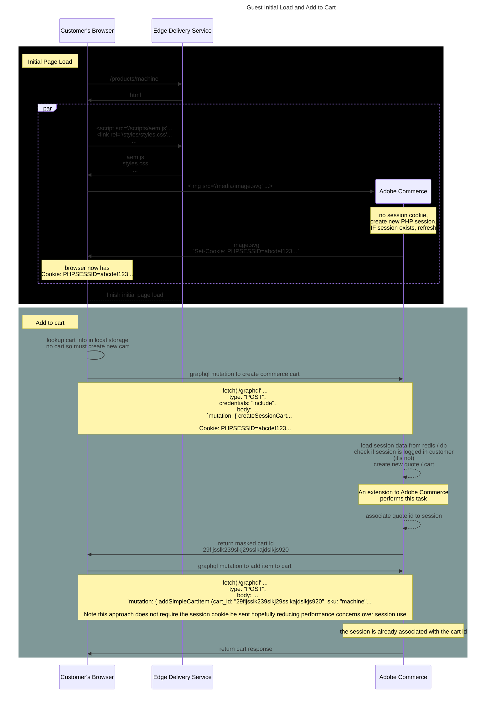

```mermaid
sequenceDiagram
    Title Guest Initial Load and Add to Cart 
    participant B as Customer's Browser
    participant E as Edge Delivery Service    
    rect rgb(0, 0, 0)
        note left of B: Initial Page Load
        B->>E: /products/machine
        E->>B: html        
        par loading assets
        B->>E: <script src="/scripts/aem.js"...<br><link rel="/styles/styles.css"...<br>...
        E->>B: aem.js<br>styles.css<br>...
        create participant M as Adobe Commerce        
        B->>M: <img src="/media/image.svg" ...>        
        Note over M: no session cookie,<br>create new PHP session.<br>IF session exists, refresh
        M->>B: image.svg<br>`Set-Cookie: PHPSESSID=abcdef123...`
        note over B: browser now has<br>Cookie: PHPSESSID=abcdef123...
        destroy E
        end
        B-->E: finish initial page load
    end     
    rect rgba(0, 50, 50, .5)
        note left of B: Add to cart
        B->B: lookup cart info in local storage<br>no cart so must create new cart
        B->>M: graphql mutation to create commerce cart
        note over B, M: fetch('/graphql' ... <br>#nbsp;#nbsp;#nbsp;type: "POST",<br>#nbsp;#nbsp;#nbsp;credentials: "include",<br>#nbsp;#nbsp;#nbsp;body: ...<br>#nbsp;#nbsp;#nbsp;#nbsp;#nbsp;`mutation: { createSessionCart... <br><br>Cookie: PHPSESSID=abcdef123...
        M-->>M: load session data from redis / db<br>check if session is logged in customer<br>(it's not)<br>create new quote / cart
        note over M: An extension to Adobe Commerce<br>performs this task
        M-->>M: associate quote id to session
        M->>B: return masked cart id<br>29fljsslk239slkj29sslkajdslkjs920
        B->>M: graphql mutation to add item to cart
        note over B, M: fetch('/graphql' ... <br>#nbsp;#nbsp;#nbsp;type: "POST",<br>#nbsp;#nbsp;#nbsp;body: ...<br>#nbsp;#nbsp;#nbsp;#nbsp;#nbsp;`mutation: { addSimpleCartItem (cart_id: "29fljsslk239slkj29sslkajdslkjs920", sku: "machine"... <br><br>Note this approach does not require the session cookie be sent hopefully reducing performance concerns over session use
        note over M: the session is already associated with the cart id
        M->>B: return cart response
    end
```

