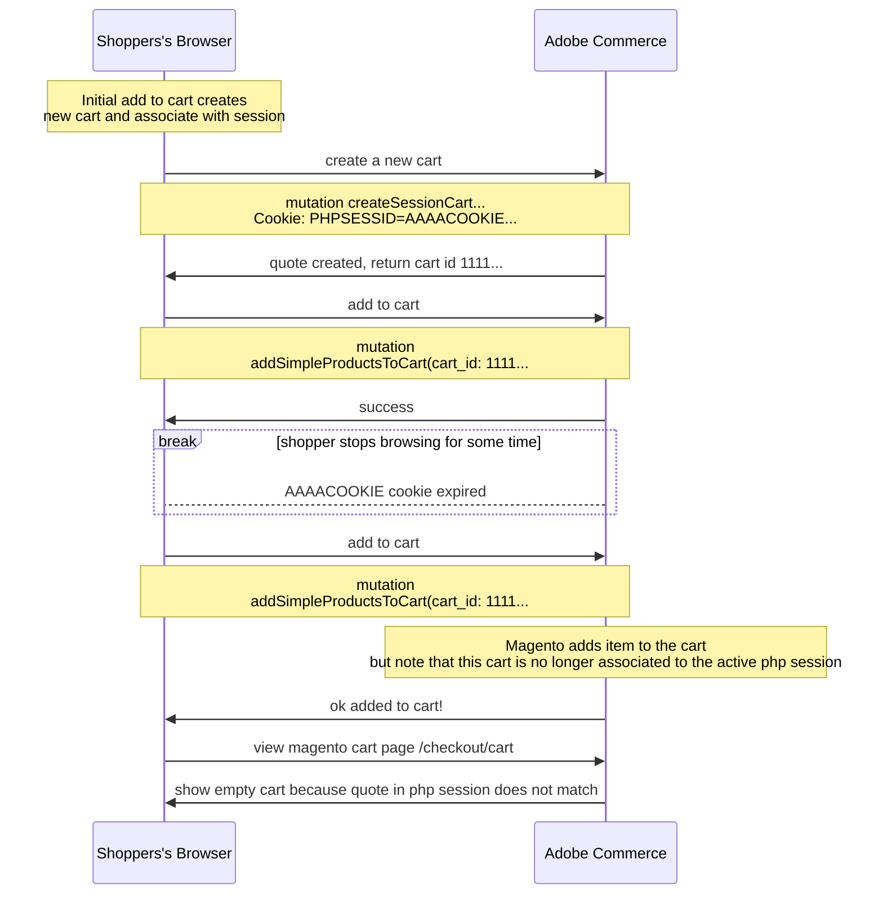

# Session State Drift Issues

This document is intended to help document possible error states in which Magento's PHP session may be out of sync with the state in the customers browser for the Edge Delivery Service headless implementation.

I believe the drift issues are different depending on the specific implementation approach (e.g. is the Magento PHP session treated as the source of truth vs the state in the customers browser local / session storage from the headless JavaScript) but there is likely overlap.

## Magento PHP Session is Source of Truth

_Note_: this approach isn't a "pure" PHP Session approach - actions such as add to cart use the cart id is still used for add to cart graphql requests and the PHP session is not used.

### PHP Session expires and is replaced but cart id still exists in local storage for old session

The PHP session lifetime isn't something we will know in JavaScript, the PHP session will just be there until it's not and is replaced with a new PHP session.

#### Potential Remidies

* Extend Magento to add sessionCart

